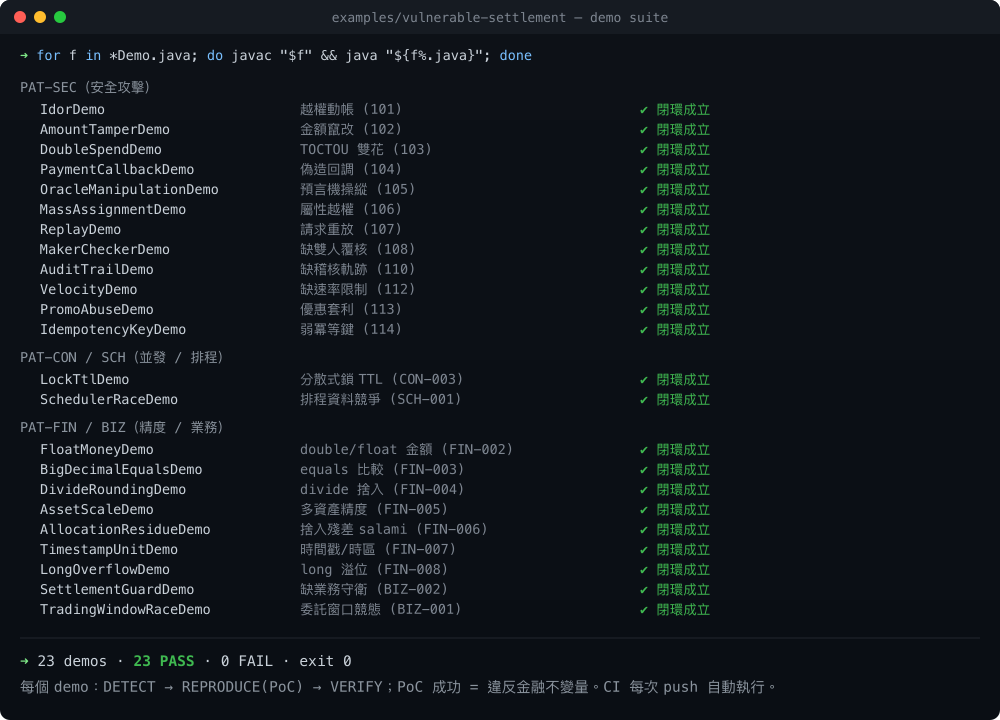

<p align="center">
  
</p>

<h1 align="center">Debug-Hunter</h1>
<p align="center">
  <b>AI-Driven Closed-Loop Fintech Debugging Framework</b><br/>
  <sub>吉祥物：粉圓 🫧 — 像牠盯著泡泡一樣，緊盯每一個金融漏洞</sub>
</p>

<p align="center">
  <a href="https://github.com/yao-beyond/debug-hunter/releases/latest"></a>
  <a href="https://github.com/yao-beyond/debug-hunter/actions/workflows/ci.yml"></a>
  <a href="https://github.com/yao-beyond/debug-hunter/actions/workflows/codeql.yml"></a>
  <a href="LICENSE"></a>
  
  
  
</p>

<p align="center"><b>正體中文</b> | <a href="README.en.md">English</a></p>

`debug-hunter` 是一個專為金融科技 (Fintech) 打造的 **AI 閉環偵錯框架**。它透過結構化的知識庫 (Knowledge-Base) 指引 AI 代理完成「**威脅建模 → 偵測 → 定級 → 復現 → 修復 → 驗收 → 回收**」的完整生命週期，專門獵殺**金融與財務安全漏洞**。


---

## 🤔 為什麼要用這個 Agent？

通用的 SAST / AI 掃描工具，對金融系統有三個致命盲點，而這正是 debug-hunter 要補的：

| 痛點 | 一般工具 | debug-hunter |
|------|---------|--------------|
| **看不懂業務邏輯** | 只抓語法層漏洞（XSS、SQLi） | 內建金流地圖、授權歸屬矩陣、清結算狀態機，能抓 **IDOR 越權提款、TOCTOU 雙花、捨入吞錢、偽造支付回調** 這類「程式沒寫錯、但有人故意」的漏洞 |
| **自信地報錯（誤報）** | 一律高危，淹沒真問題 | **證據門檻**：一個發現在補齊「汙染路徑 + DB 證據 + 反證檢查」前，只能是「疑似」，不准喊高危 |
| **只找不修** | 給一張清單就結束 | **閉環**：復現（攻擊 PoC）→ 修復 → 驗收（不變量恆成立）→ 把每個漏洞沉澱成永久規則與回歸語料，下次自動攔截 |

**一句話**：它不只問「程式會不會自己算錯」，更問「**攻擊者能不能讓它替他算**」——並用「金錢守恆」這類不變量當最後一張網，兜住所有未知手法。

---

## 🚀 核心特性

- **雙軌獵殺**: 正確性帽（浮點誤算、冪等失效）＋ 安全帽（越權、竄改、雙花、偽造、注入）。
- **三層防線**: 特徵比對（已知寫法）→ Taint 汙染流（已知攻擊面）→ 金融不變量（未知後果）。
- **治理驅動**: 所有知識條目遵循 [`knowledge-schema.md`](plugins/debug-hunter/knowledge-base/knowledge-schema.md)，可被模型解析成偵測動作，並透過 RECYCLE 安全地自我進化（防語義漂移／誤報污染）。
- **量化風險**: 基於 [`severity-loss-model.md`](plugins/debug-hunter/knowledge-base/severity-loss-model.md) 的期望資損 (ALE) 評估，告別主觀 1–5 分。
- **端到端驗證**: 集成屬性測試 (PBT) 與攻擊回歸語料，確保每個漏洞都能被自動復現並永久消滅。

---

## 📦 安裝

debug-hunter 本身就是一個**自架 plugin marketplace**，可直接在 Claude Code 與 Codex CLI 安裝。

> ℹ️ Anthropic 與 OpenAI 目前都沒有開放第三方提交到「官方公共 marketplace」的流程。這裡的「安裝」＝把**本 repo 加為 marketplace 來源**後安裝其中的 `debug-hunter` plugin。

### 方式 A：Claude Code（plugin marketplace）
```bash
# 在 Claude Code 對話中：
/plugin marketplace add yao-beyond/debug-hunter
/plugin install debug-hunter@debug-hunter-marketplace
```
安裝後即可使用 `/debug-hunter:debug-hunt <掃描範圍>` 觸發完整閉環，子代理（`threat-modeler`、`detector`、`security-fraud-detector`、`reproducer`、`root-cause`、`verifier`、`knowledge-writer`）會出現在 `/agents`。

### 方式 B：Codex CLI（plugin marketplace）
```bash
codex plugin marketplace add yao-beyond/debug-hunter
codex            # 進入互動模式
/plugins         # 啟用 debug-hunter
```

### 方式 C：直接從原始碼跑（不裝 plugin）
```bash
git clone https://github.com/yao-beyond/debug-hunter.git
cd debug-hunter
```
plugin 本體位於 `plugins/debug-hunter/`，可直接把 Claude Code 指向其中的 `AGENT.md`（見下方使用方式）。

### 選用工具（依需求）
- **Semgrep** — 跑內建靜態規則：`pipx install semgrep` 或 `brew install semgrep`
- **JDK 21+** — 跑端到端 demo（純 JDK，零第三方依賴）

---

## 📁 專案結構

本 repo 根目錄同時是**自架 marketplace**，plugin 本體集中於 `plugins/debug-hunter/`（自包含、可被兩平台複製安裝）。兩份 catalog 各自指向同一個 plugin，互不干擾。

```text
debug-hunter/                            # repo 根 ＝ 自架 plugin marketplace
├── .claude-plugin/marketplace.json      # Claude Code 目錄  ─┐
├── .agents/plugins/marketplace.json     # Codex 目錄        ─┤→ 都指向 ↓
└── plugins/debug-hunter/                # ◀ plugin 本體（兩平台共用、自包含）
    ├── .claude-plugin/plugin.json       #   Claude Code manifest
    ├── .codex-plugin/plugin.json        #   Codex manifest
    ├── AGENT.md · AGENTS.md             #   7 階段閉環總指揮（AGENTS.md＝Codex 慣例）
    ├── agents/                          #   7 個子代理：threat-modeler · detector ·
    │                                    #   security-fraud-detector · reproducer ·
    │                                    #   root-cause · verifier · knowledge-writer
    ├── skills/debug-hunter/SKILL.md     #   金融 Bug 偵測技能
    ├── commands/debug-hunt.md           #   斜線指令 /debug-hunter:debug-hunt
    ├── knowledge-base/                  #   知識庫（模式 / 不變量 / 證據標準）
    ├── rules/                           #   Semgrep + CodeQL 規則
    └── examples/                        #   23 個純 JDK 閉環 demo
```

```text
使用者安裝流程
  Claude Code:  /plugin marketplace add yao-beyond/debug-hunter
                /plugin install debug-hunter@debug-hunter-marketplace
  Codex CLI:    codex plugin marketplace add yao-beyond/debug-hunter  →  /plugins
                       └─ 兩者都會把 plugins/debug-hunter/ 整包複製到本機 plugin 快取
```

---

## 🛠️ 使用方式

### 1. 用 Claude Code 跑完整閉環（主要用法）
把 Claude Code 指向總指揮 `AGENT.md`，它會自動載入知識庫並依 7 階段執行：
```bash
claude --agent plugins/debug-hunter/AGENT.md "掃描 src/settlement 模組，找出所有高風險財務與安全漏洞"
```
或在 Claude Code 對話中讓它讀 `AGENT.md` 後下達範圍指令。它會輸出帶證據的 Findings、攻擊 PoC、修復方案與反哺規則。

### 2. 只跑單一階段 / 專責 Agent
```bash
# Stage 0：威脅建模（先想攻擊者要什麼）
claude --agent plugins/debug-hunter/agents/threat-modeler.md "對 src/wallet 的所有資金端點做威脅建模"

# Stage 1：財務安全/舞弊偵測（taint source→sink）
claude --agent plugins/debug-hunter/agents/security-fraud-detector.md "掃描 src/settlement"

# Stage 1：正確性偵測
claude --agent plugins/debug-hunter/agents/detector.md "靜態掃描 src/settlement"
```

### 3. 跑內建 Semgrep 規則（CI 可掛）
```bash
# 對你的原始碼掃描財務安全模式
semgrep --config plugins/debug-hunter/rules/semgrep/financial-security.yml src/

# 驗證規則本身（pass/fail fixture，應為 7/7 通過）
semgrep --test plugins/debug-hunter/rules/semgrep/
```

### 4. 跑端到端 demo（看閉環如何運作）
**23 個純 JDK 閉環 demo**，每個印出 DETECT → REPRODUCE(PoC) → VERIFY，PoC 成功判據＝違反某條金融不變量或精確性（CI 每次自動編譯執行）：

| 類別 | demos |
|------|-------|
| 安全攻擊 (PAT-SEC) | Idor、AmountTamper、DoubleSpend、PaymentCallback、OracleManipulation、MassAssignment、Replay、MakerChecker、AuditTrail、Velocity、PromoAbuse、IdempotencyKey |
| 並發/排程 (PAT-CON/SCH) | DoubleSpend、SchedulerRace、LockTtl |
| 精度/業務 (PAT-FIN/BIZ) | FloatMoney、BigDecimalEquals、DivideRounding、AssetScale、AllocationResidue、TimestampUnit、LongOverflow、SettlementGuard、TradingWindowRace |

```bash
cd plugins/debug-hunter/examples/vulnerable-settlement
for f in *Demo.java; do javac "$f" && java "${f%.java}"; done   # 全部跑一遍，exit 0 = 閉環成立
```



> **完整 Pattern → demo/規則 對照矩陣見 [DEMO-COVERAGE.md](plugins/debug-hunter/knowledge-base/DEMO-COVERAGE.md)**：30 條 PAT 全有佐證——23 條可執行 demo、3 條由 Semgrep/CodeQL 靜態規則涵蓋、4 條由 `reproduce-scenarios` 的 SCENE 涵蓋。各 demo 說明見 [examples README](plugins/debug-hunter/examples/vulnerable-settlement/README.md)。

### 5. 讓知識庫驅動 AI 診斷
當 AI（或你）發現異常時，引導它對照知識庫定性：
> 「請依據 [`financial-invariants.md`](plugins/debug-hunter/knowledge-base/financial-invariants.md) 檢查此 Finding 是否違反餘額守恆，對照 [`money-flow-map.md`](plugins/debug-hunter/knowledge-base/money-flow-map.md) 標記影響金流，並依 [`finding-evidence-standard.md`](plugins/debug-hunter/knowledge-base/finding-evidence-standard.md) 補齊證據後才定級。」

---

## 🗺️ 知識庫導航 (Knowledge Base)

知識分為四個層級，完整地圖見 [**MAP.md**](plugins/debug-hunter/knowledge-base/MAP.md)、逐檔索引與一致性檢查見 [**KB-INDEX.md**](plugins/debug-hunter/knowledge-base/KB-INDEX.md)：

1. **元治理 (Meta)** — 規範知識格式與證據標準：`knowledge-schema`、`finding-evidence-standard`
2. **基石 (Ground-Truth)** — 金流圖、授權矩陣、狀態機、術語表
3. **模式 (Patterns)** — 漏洞模式 (PAT-SEC/FIN/BIZ)、不變量 (INV)、風險模型
4. **執行 (Execution)** — 復現腳本、攻擊語料、Semgrep 規則、Debug 劇本

---

## 📣 對外曝光 / 收錄追蹤

| 平台 / 清單 | 連結 | 狀態 |
|------|------|------|
| GitHub Release | [v2.0.0](https://github.com/yao-beyond/debug-hunter/releases/tag/v2.0.0) | ✅ 已發佈 |
| awesome-claude（curated list） | [建議收錄 issue #259](https://github.com/webfuse-com/awesome-claude/issues/259) | ⏳ 待維護者審核 |
| 🔒 監看排程（內部） | [routine: #259 watcher](https://claude.ai/code/routines/trig_013bEfkhp1enjjmTF4BPHM1X) | 🤖 每日 09:01 自動檢查 |

> 此表追蹤 debug-hunter 的對外發佈與第三方清單收錄進度。新增曝光時請更新狀態。
> 🔒 標記為「內部」的列為私有監看工具，連結僅維護者帳號可存取（對其他讀者無效）。

---

## 📈 專案願景
消除金融系統中的「幽靈 Bug」，實現核心業務漏洞的自動化攔截與精準定級——讓每個被修好的漏洞，永遠不再回來。

---
© 2026 AetherCare Systems - Financial DevSecOps Division.
