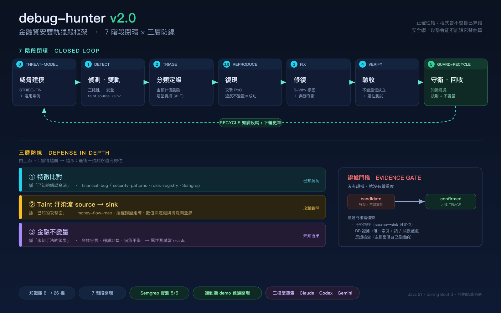

<p align="center">
  
</p>

<h1 align="center">Debug-Hunter</h1>
<p align="center">
  <b>AI-Driven Closed-Loop Fintech Debugging Framework</b><br/>
  <sub>吉祥物：粉圓 🫧 — 像牠盯著泡泡一樣，緊盯每一個金融漏洞</sub>
</p>

<p align="center">
  <a href="https://github.com/yao-beyond/debug-hunter/actions/workflows/ci.yml"></a>
  <a href="https://github.com/yao-beyond/debug-hunter/actions/workflows/codeql.yml"></a>
  <a href="LICENSE"></a>
  
  
  
</p>

<p align="center"><b>繁體中文</b> | <a href="README.en.md">English</a></p>

`debug-hunter` 是一個專為金融科技 (Fintech) 打造的 **AI 閉環偵錯框架**。它透過結構化的知識庫 (Knowledge-Base) 指引 AI 智能體完成「**威脅建模 → 偵測 → 定級 → 復現 → 修復 → 驗收 → 回收**」的完整生命週期，專門獵殺**金融與財務安全漏洞**。



---

## 🤔 為什麼要用這個 Agent？

通用的 SAST / AI 掃描工具，對金融系統有三個致命盲點，而這正是 debug-hunter 要補的：

| 痛點 | 一般工具 | debug-hunter |
|------|---------|--------------|
| **看不懂業務邏輯** | 只抓語法層漏洞（XSS、SQLi） | 內建金流地圖、授權歸屬矩陣、清結算狀態機，能抓 **IDOR 越權提款、TOCTOU 雙花、捨入吞錢、偽造支付回調** 這類「程式沒寫錯、但有人故意」的漏洞 |
| **自信地報錯（誤報）** | 一律高危，淹沒真問題 | **證據門檻**：一個發現在補齊「汙染路徑 + DB 證據 + 反證檢查」前，只能是「疑似」，不准喊高危 |
| **只找不修** | 給一張清單就結束 | **閉環**：復現（攻擊 PoC）→ 修復 → 驗收（不變量恆成立）→ 把每個漏洞沉澱成永久規則與回歸語料，下次自動攔截 |

**一句話**：它不只問「程式會不會自己算錯」，更問「**攻擊者能不能讓它替他算**」——並用「金錢守恆」這類不變量當最後一張網，兜住所有未知手法。

---

## 🚀 核心特性

- **雙軌獵殺**: 正確性帽（浮點誤算、冪等失效）＋ 安全帽（越權、竄改、雙花、偽造、注入）。
- **三層防線**: 特徵比對（已知寫法）→ Taint 汙染流（已知攻擊面）→ 金融不變量（未知後果）。
- **治理驅動**: 所有知識條目遵循 [`knowledge-schema.md`](knowledge-base/knowledge-schema.md)，可被模型解析成偵測動作，並透過 RECYCLE 安全地自我進化（防語義漂移／誤報污染）。
- **量化風險**: 基於 [`severity-loss-model.md`](knowledge-base/severity-loss-model.md) 的期望資損 (ALE) 評估，告別主觀 1–5 分。
- **端到端驗證**: 集成屬性測試 (PBT) 與攻擊回歸語料，確保每個漏洞都能被自動復現並永久消滅。

---

## 📦 安裝

### 必要
- **一個 Agent 執行器**：推薦 [Claude Code CLI](https://claude.com/claude-code)（能讀取 `AGENT.md` 指揮整個閉環）。亦可用任何支援自訂 system prompt / agent 檔的 LLM 工具。

### 選用（依需求）
- **Semgrep** — 跑內建靜態規則：`pipx install semgrep` 或 `brew install semgrep`
- **JDK 21+** — 跑端到端 demo（純 JDK，零第三方依賴）

### 取得專案
```bash
git clone <this-repo-url> debug-hunter
cd debug-hunter
```

---

## 🛠️ 使用方式

### 1. 用 Claude Code 跑完整閉環（主要用法）
把 Claude Code 指向總指揮 `AGENT.md`，它會自動載入知識庫並依 7 階段執行：
```bash
claude --agent AGENT.md "掃描 src/settlement 模組，找出所有高風險財務與安全漏洞"
```
或在 Claude Code 對話中讓它讀 `AGENT.md` 後下達範圍指令。它會輸出帶證據的 Findings、攻擊 PoC、修復方案與反哺規則。

### 2. 只跑單一階段 / 專責 Agent
```bash
# Stage 0：威脅建模（先想攻擊者要什麼）
claude --agent agents/threat-modeler.md "對 src/wallet 的所有資金端點做威脅建模"

# Stage 1：財務安全/舞弊偵測（taint source→sink）
claude --agent agents/security-fraud-detector.md "掃描 src/settlement"

# Stage 1：正確性偵測
claude --agent agents/detector.md "靜態掃描 src/settlement"
```

### 3. 跑內建 Semgrep 規則（CI 可掛）
```bash
# 對你的原始碼掃描財務安全模式
semgrep --config rules/semgrep/financial-security.yml src/

# 驗證規則本身（pass/fail fixture，應為 5/5 通過）
semgrep --test rules/semgrep/
```

### 4. 跑端到端 demo（看閉環如何運作）
9 個純 JDK 攻擊/競態閉環 demo，每個都印出 DETECT → REPRODUCE(PoC) → VERIFY，PoC 成功判據＝違反某條金融不變量（CI 每次自動編譯執行）：

| Demo | 漏洞 | 面向 | 判據 |
|------|------|------|------|
| `IdorDemo` | 越權動帳 (PAT-SEC-101) | 內部授權 | INV-ST-01 |
| `PaymentCallbackDemo` | 偽造支付回調 (PAT-SEC-104) | 外部信任 | INV-T-03 |
| `OracleManipulationDemo` | 預言機操縱 / 陳舊價 (PAT-SEC-105) | 資料完整性 | INV-ST-03 |
| `DoubleSpendDemo` | TOCTOU 雙花 (PAT-SEC-103) | 並發原子性 | INV-ST-01 |
| `MassAssignmentDemo` | 屬性越權改餘額 (PAT-SEC-106) | 欄位白名單 | INV-ST-02/05 |
| `ReplayDemo` | 請求重放 (PAT-SEC-107) | 時間序列 | INV-T-04 |
| `SchedulerRaceDemo` | 排程多 Worker 資料競爭 (PAT-SCH-001) | 排程分片/冪等 | INV-T-02 |
| `TradingWindowRaceDemo` | 委託時間窗口競態 (PAT-BIZ-001) | 業務時間窗口 | INV-T-03/ST-05 |
| `LockTtlDemo` | 分散式鎖 TTL 缺陷 (PAT-CON-003) | 鎖互斥 | INV-T-02 |

```bash
cd examples/vulnerable-settlement
javac IdorDemo.java               && java IdorDemo               # 越權動帳
javac PaymentCallbackDemo.java    && java PaymentCallbackDemo    # 偽造回調
javac OracleManipulationDemo.java && java OracleManipulationDemo # 預言機操縱
javac DoubleSpendDemo.java        && java DoubleSpendDemo        # TOCTOU 雙花
javac MassAssignmentDemo.java     && java MassAssignmentDemo     # mass assignment
javac ReplayDemo.java             && java ReplayDemo             # 請求重放
javac SchedulerRaceDemo.java      && java SchedulerRaceDemo      # 排程資料競爭
javac TradingWindowRaceDemo.java  && java TradingWindowRaceDemo  # 委託窗口競態
javac LockTtlDemo.java            && java LockTtlDemo            # 分散式鎖 TTL
# exit 0 = 閉環成立；各 demo 說明見 examples/vulnerable-settlement/README.md
```

### 5. 讓知識庫驅動 AI 診斷
當 AI（或你）發現異常時，引導它對照知識庫定性：
> 「請依據 [`financial-invariants.md`](knowledge-base/financial-invariants.md) 檢查此 Finding 是否違反餘額守恆，對照 [`money-flow-map.md`](knowledge-base/money-flow-map.md) 標記影響金流，並依 [`finding-evidence-standard.md`](knowledge-base/finding-evidence-standard.md) 補齊證據後才定級。」

---

## 🗺️ 知識庫導航 (Knowledge Base)

知識分為四個層級，完整地圖見 [**MAP.md**](knowledge-base/MAP.md)、逐檔索引與一致性檢查見 [**KB-INDEX.md**](knowledge-base/KB-INDEX.md)：

1. **元治理 (Meta)** — 規範知識格式與證據標準：`knowledge-schema`、`finding-evidence-standard`
2. **基石 (Ground-Truth)** — 金流圖、授權矩陣、狀態機、術語表
3. **模式 (Patterns)** — 漏洞模式 (PAT-SEC/FIN/BIZ)、不變量 (INV)、風險模型
4. **執行 (Execution)** — 復現腳本、攻擊語料、Semgrep 規則、Debug 劇本

---

## 📈 專案願景
消除金融系統中的「幽靈 Bug」，實現核心業務漏洞的自動化攔截與精準定級——讓每個被修好的漏洞，永遠不再回來。

---
© 2026 AetherCare Systems - Financial DevSecOps Division.
