# 🔄 Debug Recycle System

> **AI 閉環 Debug 偵察系統** — 以知識庫驅動的自我進化代理人框架

---

## 系統架構

下圖說明 `AGENT.md` 如何統籌五個代理人，透過知識庫形成持續演進的閉環 RECYCLE：



| 圖例 | 說明 |
|------|------|
| 🟢 綠色實線 | RECYCLE 回路（知識反哺） |
| 🔴 紅色實線 | 驗收失敗回滾 |
| ⬜ 灰色虛框 | SKILL.md 參考 |

---

## 五個執行 Stage

```
AGENT.md（總指揮）
│
├── Stage 1   · DETECT      → detector.md          靜態掃描，套用知識庫規則
├── Stage 2   · TRIAGE      → 風險評分分類           計算 Bug 嚴重度與優先級
├── Stage 2.5 · REPRODUCER  → 情境復現代理人          建立最小復現情境，確認可穩定復現
├── Stage 3   · FIX         → root-cause.md         5-Why 根因分析 + 修復實作
├── Stage 4   · VERIFY      → 驗收代理人             回歸測試，失敗則回滾至 FIX
└── Stage 5   · RECYCLE     → knowledge-writer.md  萃取知識，寫回知識庫
```

> **SKILL.md** 以虛線框橫跨所有 Stage，為各代理人提供偵測技能、修復策略選擇與事後檢視模板。

---

## 觸發來源

系統支援四種觸發方式，均會喚起 `AGENT.md` 啟動完整閉環：

- **PR 提交** — 每次 Pull Request 自動觸發靜態掃描
- **告警觸發** — Grafana Alert 接收到異常即時喚起
- **定時排程** — Cron Job 定期全量掃描
- **人工指令** — 手動執行特定範圍的掃描任務

---

## 整合工具

| 工具 | 用途 |
|------|------|
| SpotBugs | Java 靜態分析，偵測已知 Bug 模式 |
| PR Review Bot | 程式碼審查自動化，與 GitHub Actions 整合 |
| Grafana Alert | 正式環境監控，觸發緊急閉環流程 |

### 補強用的 GitHub 高星開源專案

為了把「金融規則型偵測」擴展成「全專案漏洞閉環」，建議額外整合以下專案：

| 專案 | 星數 | 作用 |
|------|------|------|
| Trivy | 34.5k | 容器 / 依賴 / misconfig / secrets / SBOM 掃描 |
| Nuclei | 27.9k | 已部署端點與 API 模板式弱點驗證 |
| Gitleaks | 25.9k | secrets 掃描 |
| ZAP | 15k | Web / API DAST |
| Semgrep | 14.8k | 自訂規則型 SAST |
| SonarQube | 10.4k | PR gate 與品質治理 |
| CodeQL | 9.5k | 語意型資料流安全分析 |
| OSV-Scanner | 8.7k | 開源依賴漏洞掃描 |
| Scorecard | 5.4k | 供應鏈安全健康度評估 |
| Jazzer | 1.2k | JVM fuzzing |

完整整合說明見 `knowledge-base/oss-debug-security-loop.md`。

---

## 目錄結構

```
debug-recycle-system/
├── AGENT.md                          ← 總指揮，定義 6 個 Stage 的執行流程
├── skills/
│   └── SKILL.md                      ← Bug 偵測技能、修復策略、事後檢視模板
├── agents/
│   ├── detector.md                   ← Stage 1：靜態掃描代理人
│   ├── reproducer.md                 ← Stage 2.5：情境復現
│   └── knowledge-writer.md           ← Stage 5：知識萃取與 RECYCLE 代理人
└── knowledge-base/
    ├── financial-bug-patterns.md     ← 已知 Bug 模式庫（持續累積）
    ├── oss-debug-security-loop.md    ← GitHub 高星 debug / 漏洞閉環整合清單
    ├── rules-registry.md             ← 靜態掃描規則登錄（已含 10 條規則）
    └── settlement-checklist.md       ← 結算系統 21 項強制檢查清單
```

---

## 閉環運作流程

```
觸發來源
    │
    ▼
DETECT（detector.md）
    │  查詢 financial-bug-patterns.md
    │  套用 rules-registry.md 規則
    ▼
TRIAGE（風險評分）
    │  高風險優先處理
    ▼
FIX（root-cause.md）
    │  5-Why 根因 → 產生 Patch
    ▼
VERIFY（驗收）
    │  Pass ──────────────────────┐
    │  Fail → 回滾至 FIX           │
    ▼                             │
RECYCLE（knowledge-writer.md） ◄──┘
    │  更新 financial-bug-patterns.md
    │  追加 rules-registry.md 規則
    └─► 下次 DETECT 更精準
```

---

## 快速開始

```bash
# 手動觸發完整閉環掃描
claude --agent AGENT.md "掃描 settlement 模組所有高風險問題"

# 僅執行 DETECT Stage
claude --agent agents/detector.md "靜態掃描 src/settlement/"

# 查詢知識庫已知模式
claude --agent AGENT.md "列出 financial-bug-patterns.md 中所有精度類 Bug"
```
